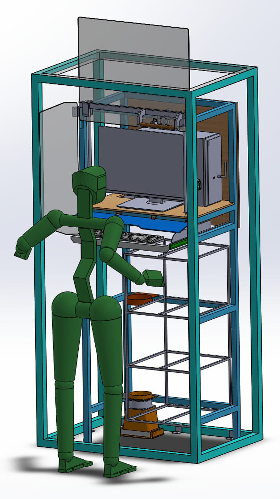
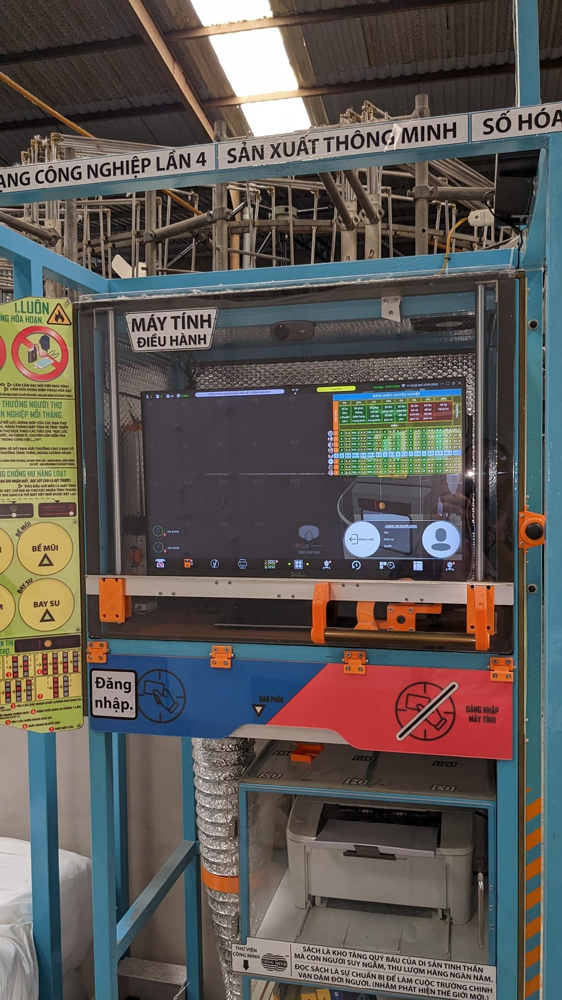
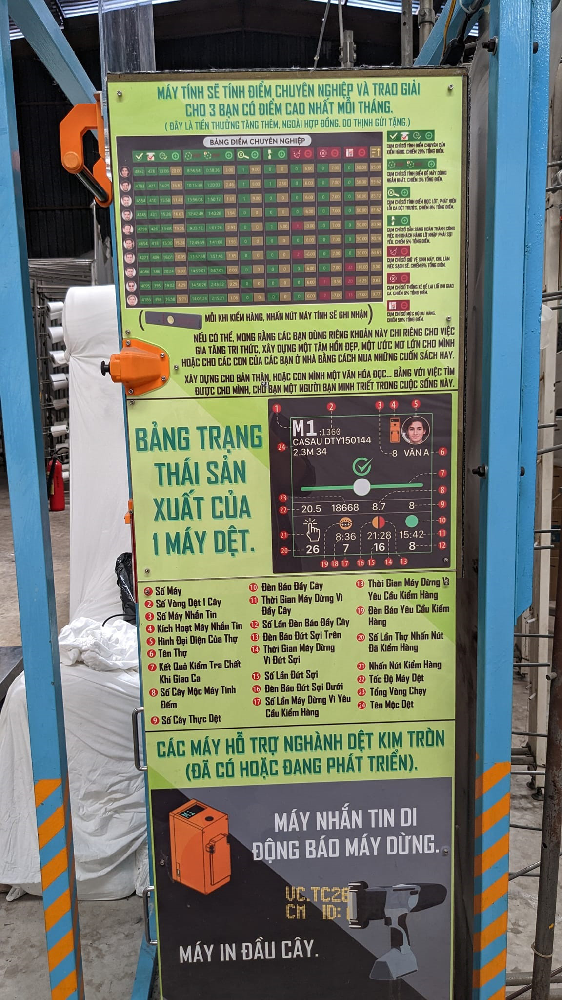
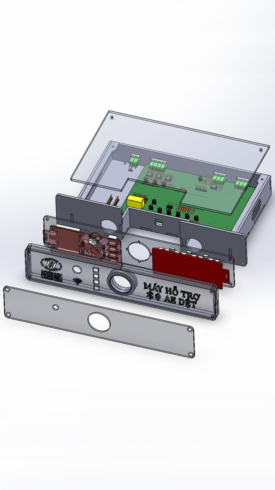
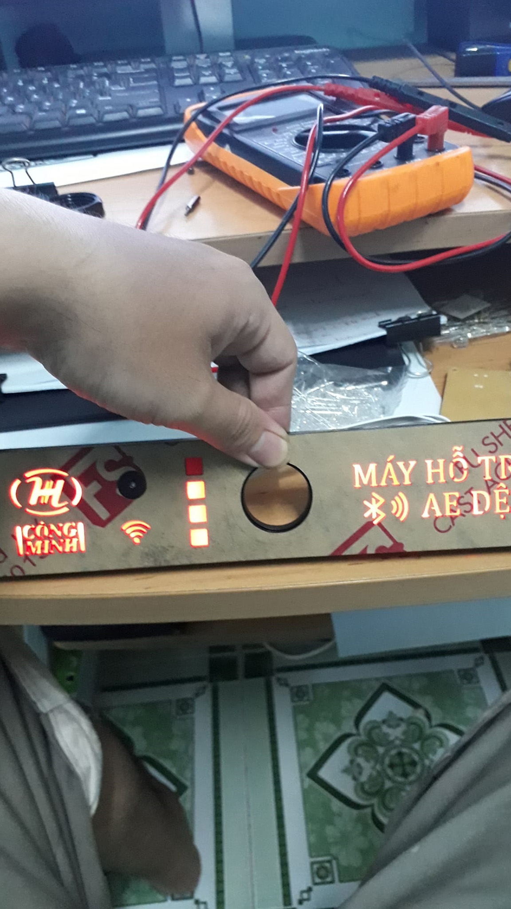
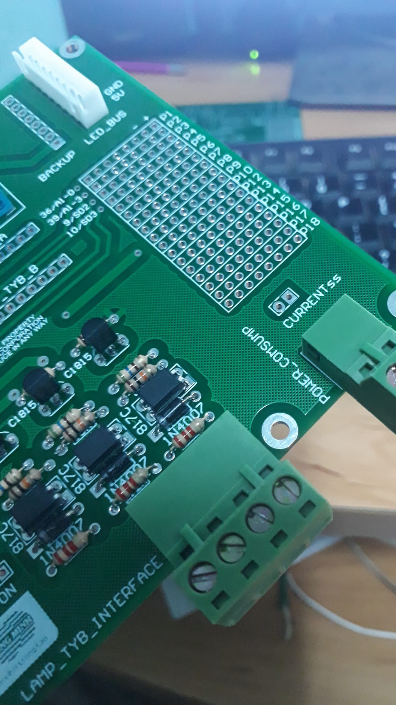
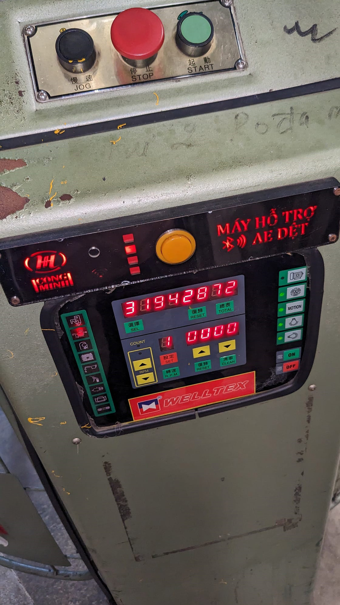
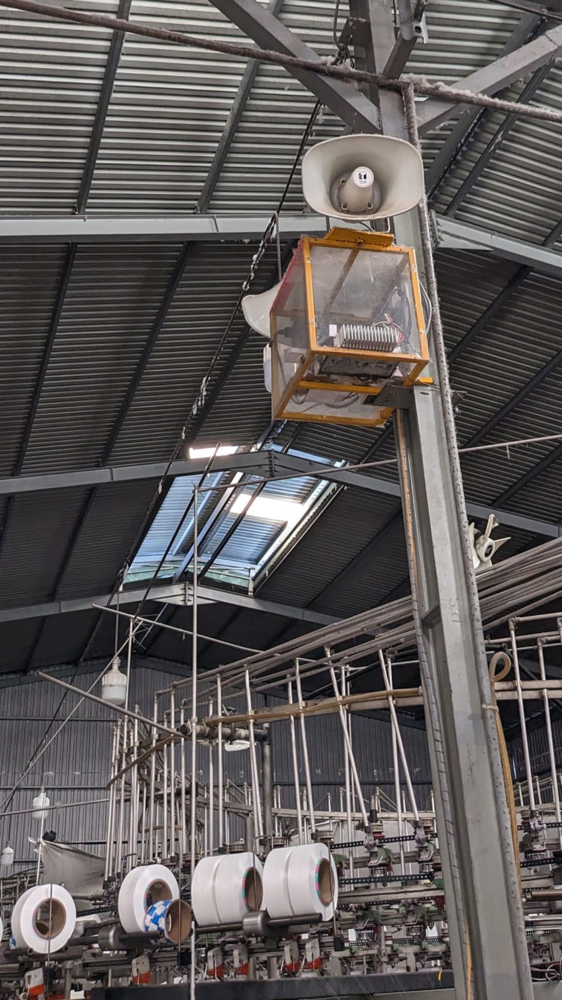

# Smart Knitting Factory 4.0 (KF4)

Hệ thống IoT / Cách mạng công nghiệp 4.0 số hóa việc giám sát sản xuất và quản lý giao hàng cho một xưởng dệt vải thun gồm **21 máy dệt**. Hệ thống thay thế các quy trình theo dõi thủ công bằng giấy bằng một trạm điều khiển trung tâm giao tiếp không dây với các board mạch IoT tự thiết kế, lắp đặt trên từng máy dệt.

> Tự thiết kế và triển khai toàn bộ: phần cứng IoT, giao thức truyền thông, phần mềm giám sát/điều khiển trung tâm và cơ sở dữ liệu.

## Tổng quan

Mỗi máy trong 21 máy dệt được lắp một board WiFi tự thiết kế (dựa trên ESP32), có chức năng:

- Nhận biết và báo cáo trạng thái thực tế của máy (đang chạy / dừng / lỗi)
- Đếm sản lượng sản xuất (số vòng/cây vải dệt được)
- Nhận lệnh điều khiển từ trạm trung tâm để bật/tắt máy từ xa

Một máy tính trung tâm (ứng dụng desktop viết bằng Qt) đóng vai trò trạm điều khiển: duy trì kết nối socket với từng board mạch trên máy dệt, hiển thị trạng thái thời gian thực trên dashboard, cho phép quản lý bật/tắt máy từ xa, và lưu toàn bộ dữ liệu vào MySQL. Hệ thống loa mạng dùng để phát thông báo (ví dụ gọi công nhân kiểm hàng định kỳ), và công nhân chấm công/đánh giá hiệu suất qua thẻ RFID.

## Tính năng chính

- **Giám sát máy dệt thời gian thực** – trạng thái, sản lượng và kết nối của cả 21 máy dệt, hiển thị trên dashboard trung tâm.
- **Điều khiển máy từ xa** – bật/tắt bất kỳ máy dệt nào trực tiếp từ máy tính trung tâm.
- **Lớp giao tiếp IoT** – TCP server (`NetworkManager`) xử lý kết nối liên tục từ tất cả board mạch trên máy, tự động dọn các kết nối chết.
- **Hệ thống loa thông báo** – một TCP server riêng (`SpeakerNetworkManager`) điều khiển loa mạng để gọi công nhân kiểm hàng định kỳ.
- **Theo dõi công nhân** – đầu đọc thẻ RFID và đồng hồ thông minh (qua UDP server) phục vụ chấm công, phân công và tính điểm hiệu suất.
- **Quản lý sản xuất & chất lượng** – quản lý sợi, loại vải/cây vải, khách hàng, hàng lỗi/hàng bẩn và in phiếu giao hàng (PDF).
- **Quản lý người dùng** – thêm/sửa công nhân, phân quyền (Giám đốc, quản lý, kỹ thuật, nghệ nhân dệt), chụp ảnh khuôn mặt/CMND.

## Kiến trúc hệ thống

```
 ┌───────────────────────────────┐        WiFi / TCP        ┌────────────────────────────┐
 │   Trạm điều khiển trung tâm     │ <-----------------------> │  Board IoT tự thiết kế(ESP32)│
 │   (Python + PySide2 / QML)     │                            │  trên từng máy dệt           │
 │                                 │        WiFi / TCP        │  x21                         │
 │  - NetworkManager (máy dệt)    │ <-----------------------> │  - đọc trạng thái máy         │
 │  - SpeakerNetworkManager        │                            │  - đếm sản lượng              │
 │  - UdpWatchServer (đồng hồ)     │        WiFi / UDP        │  - relay bật/tắt máy           │
 │  - Cơ sở dữ liệu MySQL          │ <----------------------> │  Đồng hồ thông minh (chấm công)│
 └───────────────────────────────┘                            └────────────────────────────┘
              │
              │  loa mạng (TCP)
              ▼
     Phát thông báo âm thanh ra xưởng sản xuất
```

## Công nghệ sử dụng

- **Ứng dụng**: Python 3, PySide2 (Qt for Python), QML / Qt Quick
- **Cơ sở dữ liệu**: MySQL
- **Giao tiếp**: TCP & UDP socket, đa luồng (`QThread`, `_thread`)
- **Phần cứng IoT**: Board WiFi (ESP32) tự thiết kế cho từng máy dệt
- **Thiết bị ngoại vi**: Đầu đọc RFID (UART/serial), loa mạng, đồng hồ thông minh
- **Báo cáo**: Xuất PDF phiếu giao hàng vải

## Cấu trúc project

```
KF4/
├── main.py                  # Điểm khởi chạy ứng dụng, khởi tạo các luồng giao tiếp
├── ServerListener.py        # Nhận dữ liệu từ thiết bị IoT → ghi vào database
├── models/                  # Model cho từng trang QML (mỗi tính năng/màn hình)
│   ├── HomePageModel.py
│   ├── FabricMachinePageModel.py
│   ├── SetMchStatusPageModel.py
│   ├── AsignWorkerPageModel.py
│   ├── YarnPageModel.py
│   ├── FabricPageModel.py
│   ├── CustomerPageModel.py
│   └── ...
├── supportClass/            # Các dịch vụ giao tiếp & xử lý nền
│   ├── NetworkManager.py        # TCP server cho 21 máy dệt
│   ├── SpeakerNetworkManager.py # TCP server cho hệ thống loa
│   ├── UdpWatchServer.py        # UDP server cho đồng hồ thông minh
│   ├── Uart0Listener.py / Uart1Listener.py  # Đầu đọc RFID
│   ├── WatchManager.py
│   └── TimeValue.py
├── qmls/                    # Giao diện Qt Quick (trang, control, popup, hiệu ứng)
├── database/                # Kết nối DB + file cấu hình
├── images/, soundEffects/, fonts/   # Tài nguyên giao diện
└── guideBoard/, pdfFabricDelivery/  # Tài liệu hướng dẫn & báo cáo xuất ra

MySQL/
├── KFDB_Model_One_File_If_Change_Just_Overwrite.mwb  # Schema MySQL Workbench
├── insertDBScrip_final_just_one_file.sql             # Script tạo & seed database
└── pdfModel.pdf                                      # Sơ đồ schema (PDF)
```

## Hướng dẫn cài đặt & chạy

### Yêu cầu
- Python 3
- [PySide2](https://pypi.org/project/PySide2/) (Qt for Python)
- MySQL Server
- `mysql-connector-python`

### Cài đặt
1. Tạo database bằng file `MySQL/insertDBScrip_final_just_one_file.sql`.
2. Cấu hình kết nối database trong `KF4/database/database_config.ini`:
   ```ini
   [mysql]
   host = localhost
   database = KF4DB
   user = root
   password = your_password
   ```
3. Chạy ứng dụng:
   ```bash
   cd KF4
   python main.py
   ```

Khi khởi động, ứng dụng sẽ chạy các luồng nền cho TCP server máy dệt, TCP server loa, UDP server đồng hồ thông minh, sau đó mở dashboard Qt Quick.

## Phần cứng

Thư mục `guideBoard/` chứa sơ đồ và tài liệu tham khảo cho board mạch WiFi (ESP32) tự thiết kế, lắp trên từng máy dệt, bao gồm sơ đồ đấu nối cảm biến, relay và module WiFi giao tiếp với trạm trung tâm.

## Hình ảnh triển khai thực tế

### Trạm điều khiển trung tâm

| Thiết kế 3D | Thực tế (mặt trước) | Thực tế (mặt hông - bảng thông tin) |
|---|---|---|
|  |  |  |

### Board IoT cấy vào máy dệt

| Thiết kế hộp board | Chế tạo & kiểm tra | Board đã hoàn thiện | Cấy vào máy dệt |
|---|---|---|---|
|  |  |  |  |

### Hệ thống loa mạng không dây




## Tác giả

Bùi Đức Thịnh
